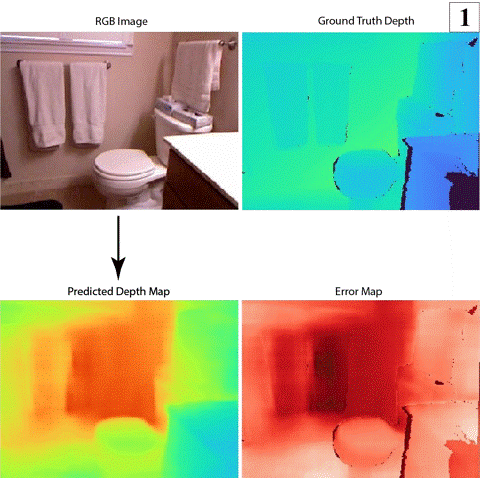
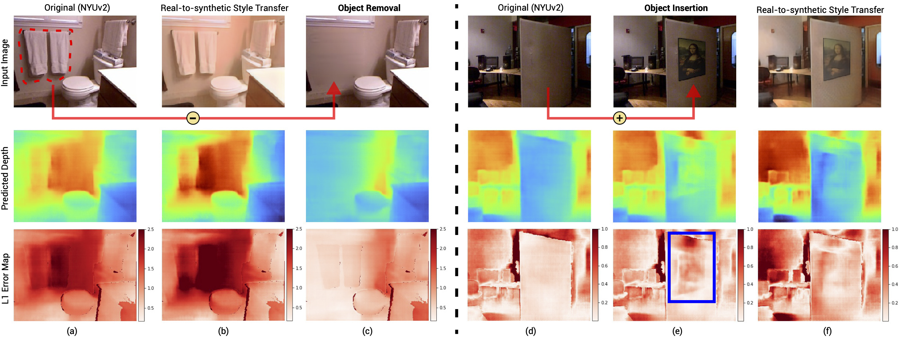

# ARC
This repo contains the Pytorch implementation of:

[Domain Decluttering: Simplifying Images to Mitigate Synthetic-Real Domain Shift and Improve Depth Estimation](http://openaccess.thecvf.com/content_CVPR_2020/html/Zhao_Domain_Decluttering_Simplifying_Images_to_Mitigate_Synthetic-Real_Domain_Shift_and_CVPR_2020_paper.html)

[Yunhan Zhao](https://www.ics.uci.edu/~yunhaz5/), [Shu Kong](http://www.cs.cmu.edu/~shuk/), [Daeyun Shin](https://research.dshin.org/) and [Charless Fowlkes](https://www.ics.uci.edu/~fowlkes/)

CVPR 2020

For more details, please check our [project website](https://www.ics.uci.edu/~yunhaz5/cvpr2020/domain_decluttering.html)

<p align="center">
  
</p>

### Abstract
Leveraging synthetically rendered data offers great potential to improve monocular depth estimation and other geometric estimation tasks, but closing the synthetic-real domain gap is a non-trivial and important task. While much recent work has focused on unsupervised domain adaptation, we consider a more realistic scenario where a large amount of synthetic training data is supplemented by a small set of real images with ground-truth. In this setting, we find that existing domain translation approaches are difficult to train and offer little advantage over simple baselines that use a mix of real and synthetic data. A key failure mode is that real-world images contain novel objects and clutter not present in synthetic training. This high-level domain shift isn’t handled by existing image translation models.

Based on these observations, we develop an attention module that learns to identify and remove difficult out-ofdomain regions in real images in order to improve depth prediction for a model trained primarily on synthetic data. We carry out extensive experiments to validate our attendremove-complete approach (ARC) and find that it significantly outperforms state-of-the-art domain adaptation methods for depth prediction. Visualizing the removed regions provides interpretable insights into the synthetic-real domain gap.



## Reference
If you find our work useful in your research please consider citing our paper:
```
@inproceedings{zhao2020domain,
  title={Domain Decluttering: Simplifying Images to Mitigate Synthetic-Real Domain Shift and Improve Depth Estimation},
  author={Zhao, Yunhan and Kong, Shu and Shin, Daeyun and Fowlkes, Charless},
  booktitle={Proceedings of the IEEE/CVF Conference on Computer Vision and Pattern Recognition},
  pages={3330--3340},
  year={2020}
}
```

## Contents

- [Requirments](#requirements)
- [Training and Inference](#training-and-inference)
- [Pretrained Models](#pretrained-models)


## Requirements
1. Python 3.6 with Ubuntu 16.04
2. Pytorch 1.1.0
3. Apex 0.1 (optional)

You also need other third-party libraries, such as numpy, pillow, torchvision, and tensorboardX (optional) to run the code. We use apex when training all models but it is not strictly required to run the code. 

## Datasets
You have to download NYUv2 and PBRS and place them in the following structure to load the data.
####  Dataset Structure
```
NYUv2 (real)
    | train
        | rgb
        | depth
    | test
        | rgb
        | depth
PBRS (synthetic)
    | train
        | rgb
        | depth      
```
You need to download Kitti and vKitti for Kitti experiments and follow the same structure. 
## Training Precedures
- [1 Train Initial Depth Predictor D](#1-Train-Initial-Depth-Predictor-D)
- [2 Train Style Translator T (pretrain T)](#2-Train-Style-Translator-T)
- [3 Train Initial Attention Module A](#3-generate-predictions)
- [4 Train Inpainting Module I (pretrain I)](#4-convert-predictions-to-pseudo-lidar-and-planes)
- [5 Jointly Train Depth Predictor D and Attention Module A (pretrain A, D)](#5-sparsify-pseudo-lidar)
- [6 Finetune the Whole System with Depth Loss](#6-graph-based-depth-correction)

All training steps use one common `train.py` file so please make sure to comment/uncomment the correct line for each step. 
```bash
CUDA_VISIBLE_DEVICES=<GPU IDs> python train.py \
  --path_to_NYUv2=<your absolute path to NYUv2> \
  --path_to_PBRS=<your absolute path to PBRS> \
  --batch_size=4 --total_epoch_num=500 --isTrain --eval_batch_size=1
```
`batch_size` and `eval_batch_size` are flexible to change given your working environment.
#### 1 Train Initial Depth Predictor D
Train an initial depth predictor D with real and synthetic data. The best model is picked by the one with minimum L1 loss. The checkpoints are saved in `./experiments/train_initial_depth_predictor_D/`.
#### 2 Train Style Translator T (pretrain T)
Train the style translator T and yield a good initialization for style translator T. The best model is picked by visual inspection & training loss curves. 
#### 3 Train Initial Attention Module A 
Train an initial attention module A from scratch with descending $\tau$ values.
#### 4 Train Inpainting Module I (pretrain I)
Train the inpainting module I with A (from step 3) and I (from step 2). This leads to a good initalization to I.
#### 5 Jointly Train Depth Predictor D and Attention Module A (pretrain A, D)
Further jointly train depth predictor D and attention module A together with D (from step 1), T (from step 2), A (from step 3) and I (from step 4). The A and D learned from this step is the good initialization before finetuning the whole system together with depth loss. In step 5 and later step 6, we train for relatively less epochs, i.e.,  `total_epoch_num = 150`. 
#### 6 Finetune the Whole System with Depth Loss (Modular Coordinate Descent)
This step corresponds to the modular coordinate descent shown in our paper. The experimental results on NYUv2 dataset we reported in the paper are the evaluation results from this step (one step finetuning).

## Evaluations
Evaluate the final results
```bash
CUDA_VISIBLE_DEVICES=<GPU IDs> python train.py \
  --path_to_NYUv2=<your absolute path to NYUv2> \
  --path_to_PBRS=<your absolute path to PBRS> \
  --eval_batch_size=1
``` 
Make sure uncomment step 6 in the `train.py` file. If you want to evaluate with your own data, please place your own data under `<real dataset>/test` with the dataset structure described above.

## Pretrained Models
Pretrained models for the NYUv2 & PBRS experiment are available [here](https://drive.google.com/drive/folders/1gB4dE3qoHrNGQqqU7cea7Z3MouPIJA9m?usp=sharing)
Pretrained models for the Kitti & vKitti experiment are available [here]()

## Acknowledgments
This code is developed based on [T2Net](https://github.com/lyndonzheng/Synthetic2Realistic) and [Pytorch-CycleGAN](https://github.com/junyanz/pytorch-CycleGAN-and-pix2pix).

## Questions
Please feel free to email me at (yunhaz5 [at] ics [dot] uci [dot] edu) if you have any questions.